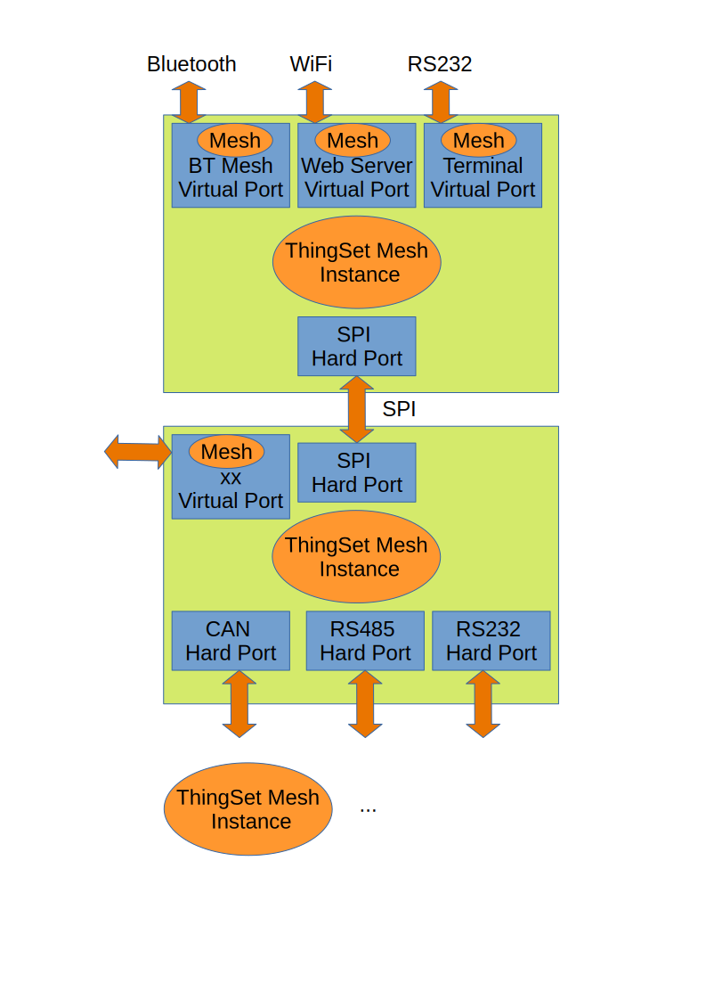

# C library for ThingSet Mesh devices

The ThingSet Mesh protocol is very early work in progress.

The [ThingSet Mesh design concept](docs/mesh.md) describes the current state of design.

## What a ThingSet Mesh is for

The primary focus is to enable users/ applications to issue [ThingSet Protocol](https://libre.solar/thingset/)
statements that are routed to the intended sink which is not on the same mesh
device and maybe several hops way. The connection between these hops may be of
different kind -  e.g. CAN, RS232, SPI, ... . The number of mesh devices in the
mesh is assumed to be low (<= 100).

## What a ThingSet Mesh is not for

The ThingSet Mesh shall not replace Eithernet based M2M communication or be a
candidate for an IoT cloud protocol. The idea is to have gateways (called
virtual ports) that translate from a ThingSet Mesh to these other Worlds.

## What a ThingSet Mesh looks like

